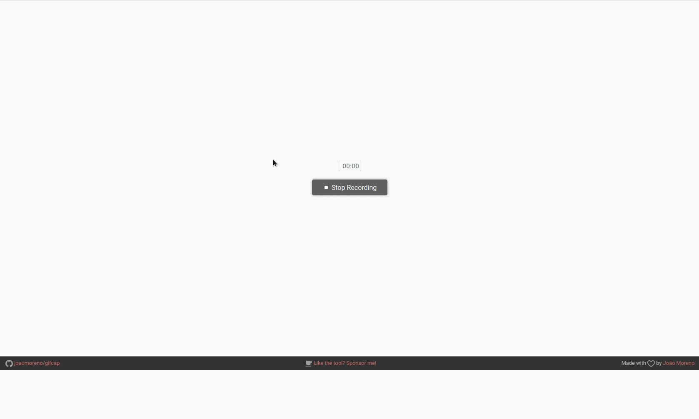

# i need help with update script (let me know in the discussions tab via github)

# BakChat version 1.4.0 config update

BakChat is a multipurpose & lightweight chat application written in nodeJS. BakChat has a very similar Ui and backbone compared to "LowChat", then I decided to make it better... AND LOOK AT IT NOW 

DONT FLAG ME FOR THE CUSSWORDS FILTER ON LINE 26
## Demo
i know the readme is broken but it almost murdered my RAM since it was full HD 😂

## Developers:
[@40476](https://replit.com/@40476) Lead Developer \
[@Durrwin](https://replit.com/@durrwin) Ideas Person, Front End Designer, Developer, Media Manager
## Special Credits:
[StackOverFlow](https://stackoverflow.com)\
[W3schools](https://w3schools.com)\
[Vandesm14 (original chat framework)](https://replit.com/@vandesm14)\
[404 page by sarazond](https://codepen.io/sarazond/pen/jOKyjZ)
## Admin instructions
* Censored chat messages will not be sent
* 